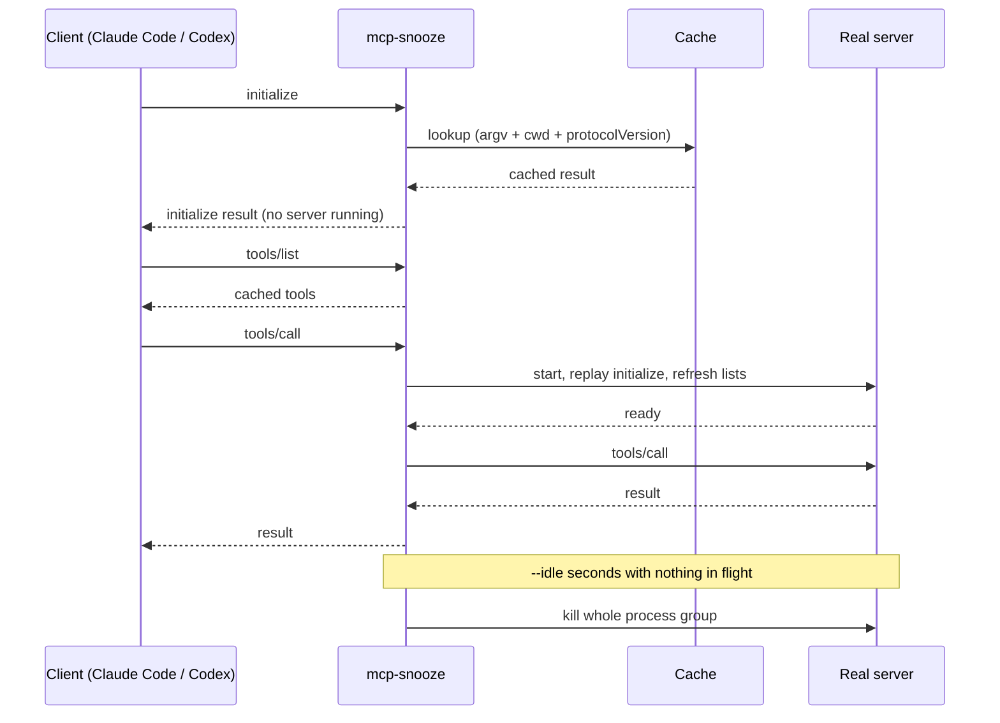

# mcp-snooze

A tiny stdio proxy that starts your MCP server on the first tool call and stops it when idle.

Every Claude Code or Codex session spawns every configured stdio MCP server at startup and keeps it alive for the whole session, even if no tool is ever called. With several sessions open, that is N copies of every JVM, node and python server you have configured. `mcp-snooze` sits in front of a server, answers the handshake and list requests from a cache, and only runs the real server while it is actually being used.

## Benchmark

`python3 bench/bench.py --bin ./mcp-snooze --sessions 3 --mb 50` (macOS arm64):

| scenario | processes | RSS MiB |
|---|---:|---:|
| bare, idle | 3 | 186.5 |
| snoozed, idle | 0 | 17.5 |
| snoozed, after 1 call | 1 | 80.0 |
| snoozed, after idle reap | 0 | 17.9 |

Saving: 90.6% (earlier runs gave 90.8% and 90.4%).

This is a synthetic benchmark: the "server" is a small Python script that holds 50 MB of memory per session, so the saving depends on how heavy your real servers are. The "processes" column counts real server processes; the RSS column also includes the proxies. Real servers (a JVM one, one launched through `npx`, and Firebase's) were smoke-tested behind the proxy: cold first call 1.6 to 3 s, warm calls no measurable overhead, and no leftover processes after the idle reap.

## Quick start

Install (the binary must be named `mcp-snooze`; `wrap` refuses any other name):

```bash
go install github.com/askmegit/mcp-snooze@latest
```

Then let it rewrite your configs:

```bash
mcp-snooze scan              # list stdio servers, whether they are snoozed, and their memory
mcp-snooze wrap --dry-run    # show what would change
mcp-snooze wrap              # rewrite ~/.claude.json and ~/.codex/config.toml
# restart your Claude Code / Codex sessions
mcp-snooze unwrap            # undo
```

`wrap` and `unwrap` accept `--harness claude,codex`, `--server NAME` (repeatable), `--idle SECONDS` and `--dry-run`. Without `--server`, disabled Codex servers and servers inside a `.app` bundle are skipped. Harnesses read these configs when a session starts, so running sessions keep their old servers until restarted.

Or edit a config by hand.

Claude Code (`~/.claude.json`):

```json
"some-mcp": {
  "command": "mcp-snooze",
  "args": ["--idle", "600", "--", "npx", "-y", "some-mcp"]
}
```

Codex (`~/.codex/config.toml`):

```toml
[mcp_servers.some-mcp]
command = "mcp-snooze"
args = ["--idle", "600", "--", "npx", "-y", "some-mcp"]
```

Flags (before the `--`):

| flag | default | meaning |
|---|---|---|
| `--idle` | 600 | seconds with nothing in flight before the server is killed |
| `--cache-dir` | user cache dir + `/mcp-snooze` | where initialize and list responses are cached |
| `--max-age` | 604800 (7 days) | maximum cache age in seconds |
| `--start-timeout` | 60 | seconds to wait for proxy-owned requests to the real server |

## How it works



- **Cache.** `initialize`, `tools/list`, `prompts/list`, `resources/list`, `resources/templates/list` (when the server advertises those capabilities) and `ping` are answered locally. `ping` needs no cache. The cache key is argv + cwd + `protocolVersion`.
- **Lazy start.** Any other request, such as `tools/call`, starts the real server and replays the client's `initialize` to it. Paginated list requests (with a cursor) are not served from the cache.
- **First run.** With no cache yet, `initialize` itself starts the real server once, to populate the cache. After that, sessions start with zero server processes.
- **Idle reap.** After `--idle` seconds with no request in flight, the whole process group is killed, so `npx`, `uvx` and `sh` launchers die with their children. The next call starts it again.
- **Errors are never cached.** Only successful responses are stored.
- **Refresh.** When a freshly started server returns lists that differ from the cache, the proxy updates the cache and sends `notifications/tools/list_changed` (or the resources/prompts equivalent) to the client. A `tools/list_changed` from the server also refreshes the cached tool list.
- **Forwarding.** Client cancellations and responses to server-initiated requests are forwarded to the running server.

## Claude Code plugin

A plugin with a skill for scanning and wrapping is provided under `plugin/`, with a marketplace entry at `.claude-plugin/marketplace.json`:

```
/plugin marketplace add askmegit/mcp-snooze
/plugin install mcp-snooze@mcp-snooze
```

The plugin drives the same `mcp-snooze` binary, so you still need it on your `PATH`.

## How it compares

From a survey of existing projects (repository READMEs and issues, checked 2026-09-29). "not stated" means the project's own material does not say.

| project | lazy start | idle reap | keeps real tool names | config rewrite | notes |
|---|---|---|---|---|---|
| mcp-snooze | first `tools/call` | yes | yes | yes (Claude Code, Codex) | one proxy per server, no shared daemon |
| mcp-lazy (PeterCha90) | first call through a meta-tool | not stated | no, 2 meta-tools | yes (`add --cursor` etc.) | targets context tokens |
| mcp-lazy-proxy (sarthakpranesh) | on first use | yes, 5 min | no, 2 meta-tools | not stated | |
| lazy-mcp (voicetreelab) | via meta-tools | not documented | no, meta-tools | not stated | targets context tokens |
| 1mcp-app/agent | lazy mode defers schemas only | no | not stated | not stated | README: lazy loading "does not reduce backend connections or processes" |
| mcp-proxy (sparfenyuk) | no | no | yes | no | stdio to SSE / HTTP transport bridge |
| docker/mcp-gateway | not stated | not stated | not stated | no | dynamic, session-scoped server adds |
| Claude Code `MCP_DISCOVERY_CACHE=1` | see note below | no | yes | n/a | Claude Code only |

The survey found no project that keeps real tool names, starts on first call, reaps on idle and answers lists from a cache. It was a small sample, not an exhaustive search.

Claude Code has an env var `MCP_DISCOVERY_CACHE=1`. In our test with `claude -p` it still spawned stdio servers on every run. We did not test interactive mode, and this is an observation about that setup, not a claim about Claude Code in general.

## FAQ

**How slow is the first call?** It pays for starting the server plus the initialize replay. Measured on real servers: 1.6 to 3 s cold; warm calls added no measurable overhead. Set `--idle` higher if you would rather hold a server longer.

**What about servers with state?** Each session has its own proxy and its own server process, so state is never shared. Reaping only happens when no request is in flight and nothing is waiting on the client, but state does not survive a reap: sessions, subscriptions (`resources/subscribe`) and in-memory data die with the process. The proxy does not track or replay subscriptions. Server-initiated requests (sampling, roots, elicitation) are forwarded to the client and the replies routed back while the server is running. For stateful servers such as a browser or device driver, use a long `--idle` or do not wrap them (`wrap --server` lets you pick).

**Windows?** Windows code exists (`proxy_windows.go`) and CI builds it on `windows-latest`, but the test steps run only on Linux and macOS. Treat Windows as untested. `scan` reads process memory via `ps`, so it reports memory only on macOS and Linux.

**http / sse servers?** Untouched. Only stdio entries are wrapped.

**Where are backups?** `wrap` and `unwrap` copy each config to `~/.mcp-snooze/backups/<timestamp>/` before writing (directories 0700, files 0600). The newest 10 runs are kept. Writes are atomic and abort if the config changed while being processed.

## Limitations

- `wrap` re-encodes `~/.claude.json`, which sorts its keys. The content is preserved, the key order is not. Only user-level and per-project `mcpServers` in that file are handled.
- Codex entries are edited in place, changing only `command` and `args`. Servers not written as a plain `[mcp_servers.NAME]` table with single-line values (inline tables, for example) are left alone rather than rewritten, and may not show up in `scan`.
- Changing `--idle` on an already wrapped server needs `unwrap` and then `wrap --idle N`.
- `scan` matches processes to servers by command line via `ps`; per-server memory is a best-effort figure.
- The MCP spec dated 2026-07-28 removes the `initialize` handshake. The replay-based design here targets the current handshake; support for the new spec is on the roadmap.

## Development

```bash
go build -o mcp-snooze .
go test ./...
python3 tests/test_proxy.py
python3 tests/test_harness.py
```

## License

MIT
